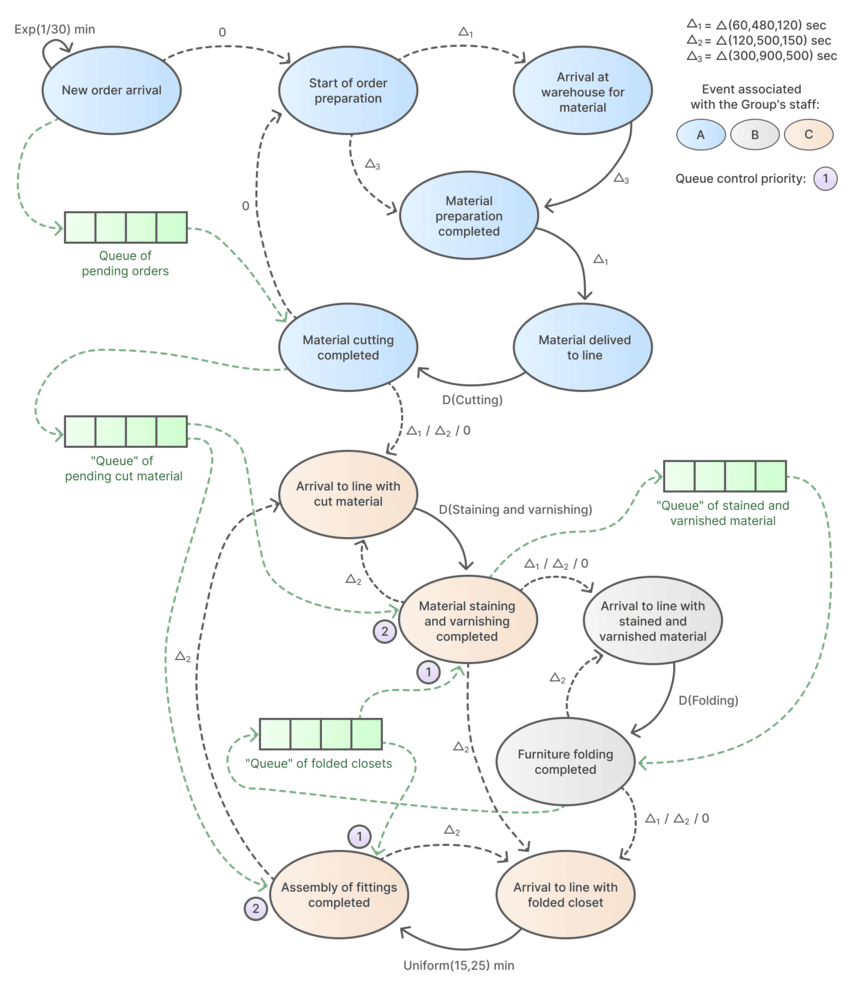
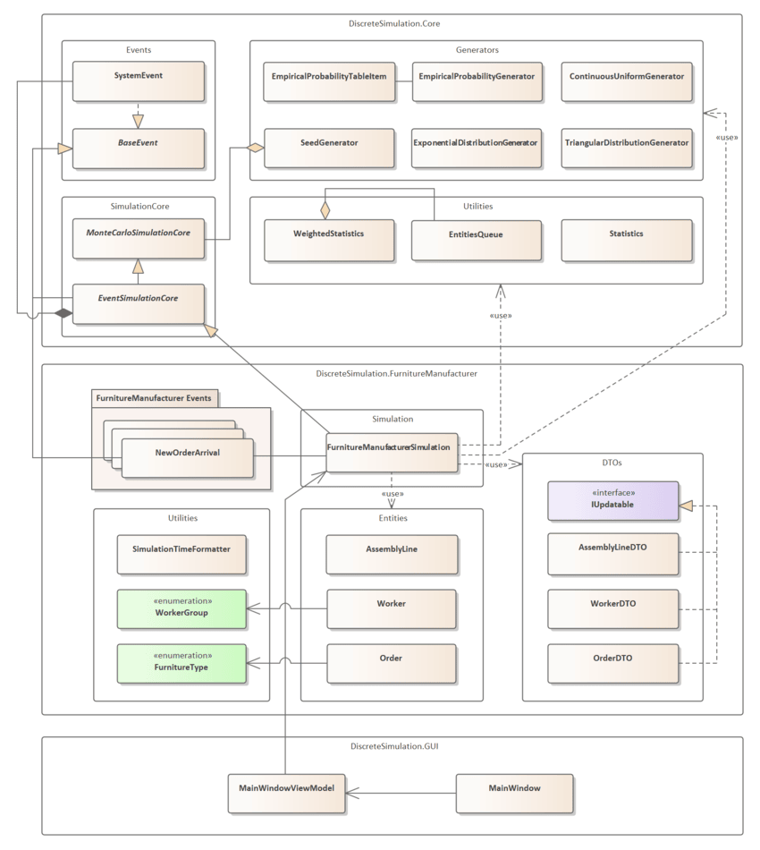
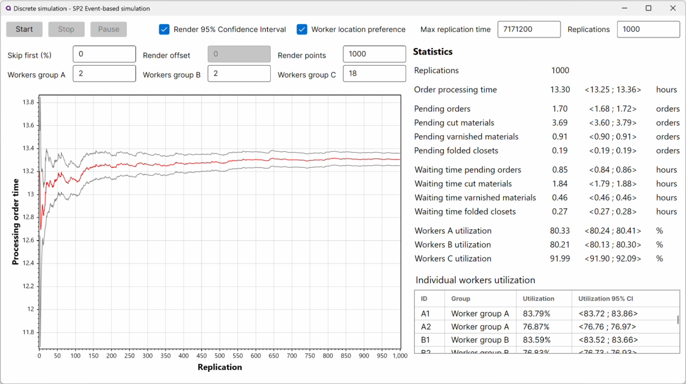
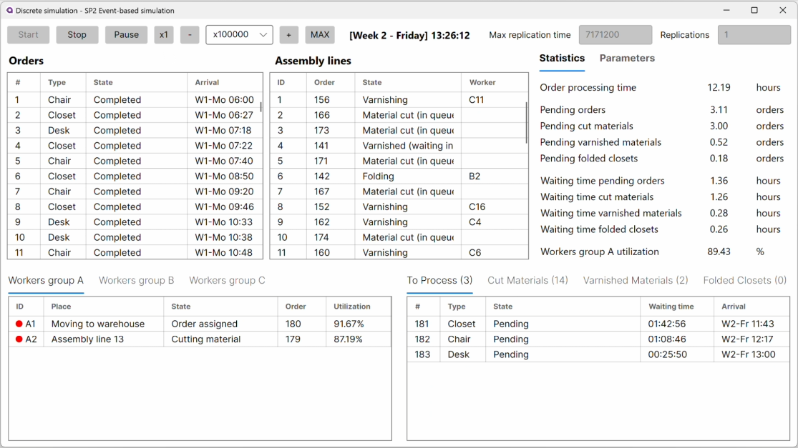
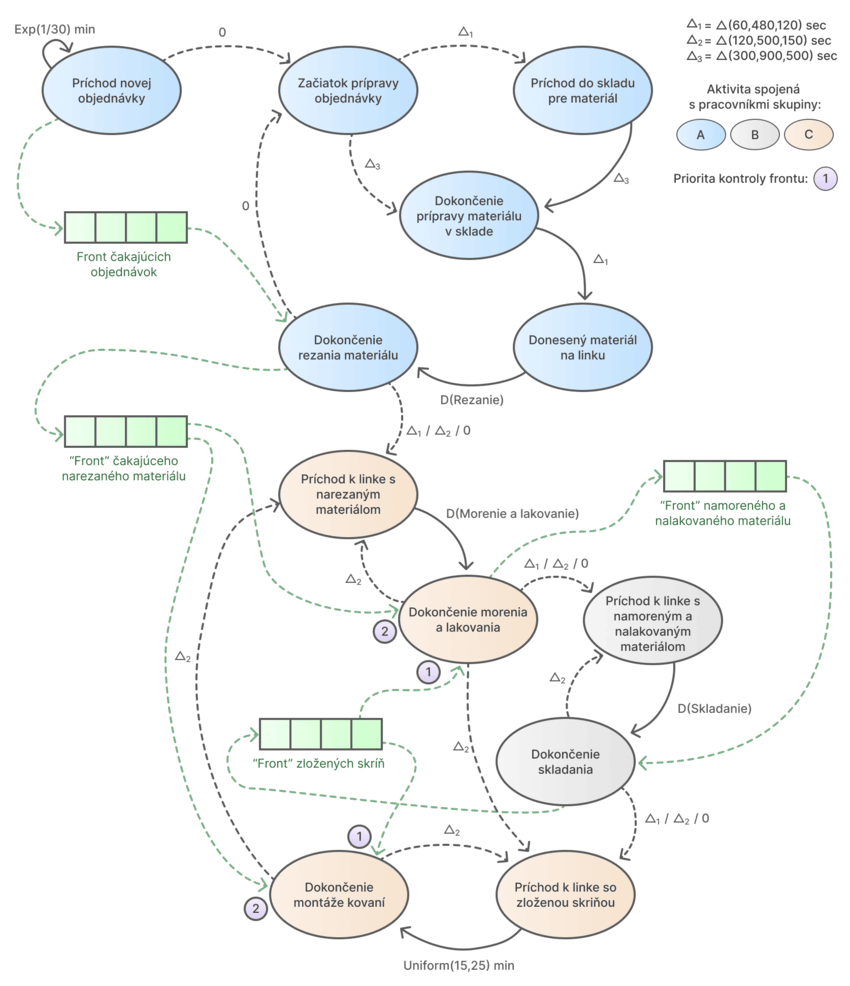

# 🪑 Furniture manufacturer Discrete-Event Simulation
This project simulates the operations of a furniture manufacturer using discrete-event simulation techniques. The simulation models the workflow of furniture production, including the processing of orders, material handling, and worker assignments. The objective is to analyze the efficiency of the production process and determine optimal number of employees for different groups of workers (A, B, C). The simulation is built using .NET and Avalonia for the user interface.

The application was developed as the second semester work on the Discrete Simulation course at the Faculty of Management Science and Informatics of the University of Žilina.

## 🎯 Key Objectives
- Determine optimal worker counts per group (A/B/C)
- Ensure average order processing time < 16 working hours
- Design of simulation experiments to find optimal configuration
- Statistical analysis of simulation results (using 95% confidence intervals)

## 🛠️ Core Features
- 🕹️ Two simulation modes:
  - **Single-run**: Detailed workflow visualization
  - **Multi-run**: Statistical analysis with 95% confidence intervals
- 🔧 Customizable parameters:
  - Worker counts per group (A/B/C)
  - Simulation duration (249 work days)
- 📊 Real-time monitoring:
  - Order queue lengths
  - Worker utilization rates
  - Production stage durations
  - Other statistics
- 📈 Convergence trends visualization for average processing order time
- ⏱️ Accelaration and deceleration of simulation run speed

## 🚀 Video Preview
...

## 🏭 Simulation Scenario
Models a furniture workshop producing:
- 🟫 **Tables** (50% of orders)
- 🪑 **Chairs** (15%)
- 🚪 **Closets** (35%)

### Production Workflow
1. **Group A**: 🪚 Material preparation and cutting
2. **Group C**: 🖌️ Staining and varnishing
3. **Group B**: 🛠️ Assembly
4. **Group C**: 🪛 Fittings installation (wardrobes only)

### Key Parameters
- Order arrival: Poisson process (λ=2 orders/hour)
- Worker movement times: Triangular distributions
- Processing times vary by furniture type (see documentation)

## 🔀 Event Diagram

    
    

        <em>Diagram of the discrete events used in the simulation.</em> 
        <em>Solid arrows indicate that the first event always triggers the second event.</em> 
        <em>Dashed arrows indicate that the first event may trigger the second event.</em>
    

## 🛠️ Program Architecture

    
    

        <em>Simplyfied class diagram of the program architecture</em>
    

## 📚 Documentation
[📘 Detailed semester work documentation](docs/documentation.pdf) includes details about:
- Discrete-event simulation core architecture
- Event scheduling algorithm
- Random number generators using seed generator
- Details about each discrete event
- Design and statistical analysis of simulation experiments

 

<em>Multiple replications simulation showing average processing time of order over replications and various statistics as means and 95% confidence intervals</em>

<em>Single replication simulation showing current state of single replication run with detailed statistics</em>

 
 
 

# 🪑 Udalost-orientovaná simulácia výrobcu nábytku
Tento projekt simuluje prevádzku výrobcu nábytku pomocou udalostne orientovanej simulácie. Simulácia modeluje pracovný postup výroby nábytku, vrátane spracovania objednávok, manipulácie s materiálom a prideľovania pracovníkov. Cieľom je analyzovať efektívnosť výrobného procesu a určiť optimálny počet zamestnancov pre rôzne skupiny pracovníkov (A, B, C). Simulácia je postavená na platforme .NET a používateľské rozhranie je implementované pomocou Avalonia frameworku.

Aplikácia bola vytvorená ako druhá semestrálna práca v rámci predmetu Diskrétna simulácia na Fakulte riadenia a informatiky Žilinskej univerzity v Žiline.

## 🎯 Hlavné ciele
- Určiť optimálny počet pracovníkov v každej skupine (A/B/C)
- Zabezpečiť priemerný čas vybavenia objednávky < 16 pracovných hodín
- Návrh simulačných experimentov pre nájdenie optimálnej konfigurácie
- Štatistická analýza výsledkov simulácie (pomocou 95% intervalov spoľahlivosti)

## 🛠️ Hlavné funkcie
- 🕹️ Dva režimy simulácie:
  - **Jednorazová simulácia**: Podrobná vizualizácia pracovného postupu
  - **Viacnásobná simulácia**: Štatistická analýza s 95% intervalmi spoľahlivosti
- 🔧 Konfigurovateľné parametre:
  - Počet pracovníkov v skupinách (A/B/C)
  - Doba simulácie (249 pracovných dní)
- 📊 Sledovanie v reálnom čase:
  - Dĺžky frontov objednávok
  - Miera vyťaženia pracovníkov
  - Doba trvania výrobných fáz
  - Ďalšie štatistiky
- 📈 Zobrazenie grafu konvergencie priemerného času vybavenia objednávky
- ⏱️ Rýchlosť simulačného behu je možné zrýchliť alebo spomaliť

## 🚀 Video ukážka
...

## 🏭 Simulačný scenár
Modelujeme dielňu na výrobu nábytku, ktorá vyrába:
- 🟫 **Stoly** (50% objednávok)
- 🪑 **Stoličky** (15%)
- 🚪 **Skrine** (35%)

### Pracovný postup výroby
1. **Skupina A**: 🪚 Príprava a rezanie
2. **Skupina C**: 🖌️ Morenie a lakovanie
3. **Skupina B**: 🛠️ Skladanie
4. **Skupina C**: 🪛 Montáž kovaní (iba pre skrine)

### Kľúčové parametre
- Príchod objednávok: Poissonov proces (λ=2 objednávky/hod)
- Časy presunu pracovníkov: Trojuholníkové rozdelenia
- Časy spracovania sa líšia podľa typu nábytku (viď dokumentácia)

## 🔀 Diagram udalostí

    
    

        <em>Diagram diskrétnych udalostí použitých v simulácii.</em> 
        <em>Plné šípky znamenajú, že prvá udalosť vždy naplánuje druhú udalosť.</em> 
        <em>Čiarkované šípky znamenajú, že prvá udalosť môže naplánovať druhú udalosť.</em>
    

## 🛠️ Architektúra programu

    
    

        <em>Zjednodušený diagram tried architektúry programu</em>
    

## 📚 Dokumentácia
[📘 Podrobná dokumentácia semestrálnej práce](docs/documentation.pdf) obsahuje podrobnosti: 
- Jadro architektúry udalost-orientovanej simulácie
- Algoritmus plánovania udalostí
- Generátory pseudonáhodných čísel pomocou generátora násad
- Podrobnosti o každej diskrétnej udalosti
- Návrh a štatistická analýza simulačných experimentov

 

<em>Simulácia s viacerými replikáciami, ktorá zobrazuje graf ustaľovania priemerného času vybavenia objednávky počas replikácií a rôzne štatistiky v podobe priemerov a 95% intervalov spoľahlivosti</em>

<em>Simulácia zobrazujúca jednu replikáciu, ktorá zobrazuje aktuálny stav behu simulácie s podrobnými štatistikami</em>

